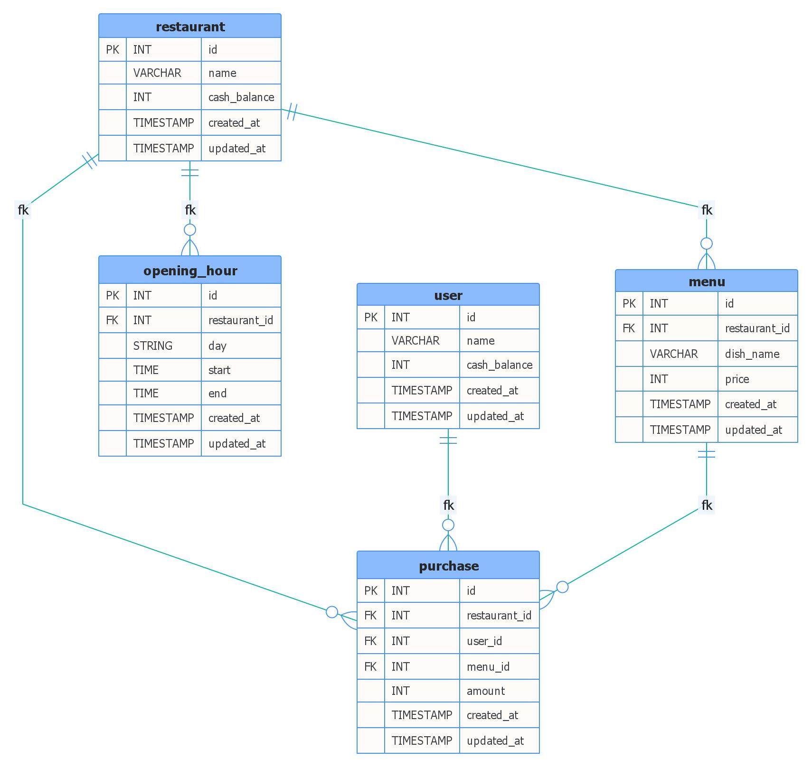

# FoodBear API

## ERD
<a href="docs/erd.jpg"></a>

## Development
1. Install all packages using npm/pnpm/yarn.
```
npm install
```
2. Run all the services (postgresql, meilisearch, redis) using docker or if you have install directly on your machine then make sure all of the services are running.

```
docker compose up -d
```
3. Setup your env file by copying the .env-sample to .env. Don't ever **delete** or **rename** the .env-sample. Create new file! Fill in all the relevant details.
4. Run the app.
```
npm run dev
# or
npm run dev:watch #auto reload
```

> We will not be running the app on docker due to poor performance when reloading/restarting app in Windows. If you want to run it through docker, then just uncomment the app section in the docker-compose.yml. 

## Deployment

1. Heroku
> Meilisearch will not work as there is no support for it. You can still use normal search api with less performance. 
2. DigitalOcean
    1. asdasasda

    
## API Route Documentation

### Summary
> You can view the full api documentations on Postman or the openapi schema file in the docs folder.

### Postman
[](https://app.getpostman.com/run-collection/1198381-e0614068-ecc2-4fa3-92d6-4397a37e1112?action=collection%2Ffork&collection-url=entityId%3D1198381-e0614068-ecc2-4fa3-92d6-4397a37e1112%26entityType%3Dcollection%26workspaceId%3D13a222dc-25e7-4b4c-8cbc-d13a44e13a15)
